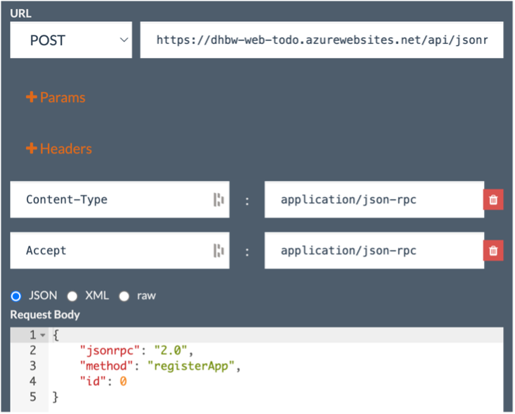
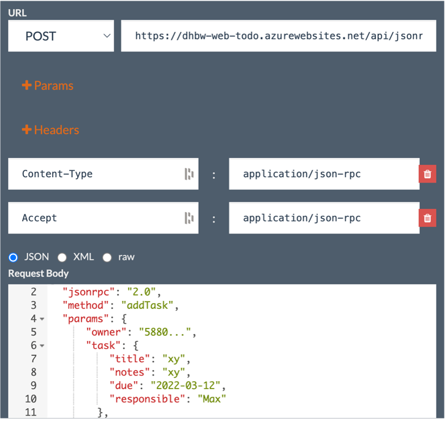

== Übungsaufgabe zu Modul 2a (JSON-RPC)

In dieser Übungsaufgabe wird die aus der vorhergehenden Lehrveranstaltung bekannte Web-Anwendung auf eine HTTP-basierte JSON-RPC API umgestellt.

=== Platzhalter

Nachfolgend sind die spezifischen Parameter, die in der grundlegenden Einführung zu den Übungen erwähnt sind.

|===
|Platzhalter |Wert

|`<initial-github>`
|https://github.com/baitando/dhbw-distributed/tree/main/01-jsonrpc/initial

|`<initial-download>`
|https://baitando.github.io/down-git/#/home?url=https://github.com/baitando/dhbw-distributed/tree/main/01-jsonrpc/initial

|`<initial-ide`
|https://stackblitz.com/fork/github/baitando/dhbw-distributed/tree/main/01-jsonrpc/initial?file=index.html&terminal=stackblitz&title=%C3%9Cbungsaufgabe%20%7C%20Modul%202a%20%28JSON-RPC%29
|===

=== Aufgabenbeschreibung

==== Kennenlernen der API

Machen Sie sich zunächst mit der API vertraut.
Nutzen Sie hierzu den Online HTTP-Client https://www.apirequest.io/ und senden Sie entsprechende Anfragen an die API.
Die URL lautet: https://dhbw-web-todo.azurewebsites.net/api/jsonrpc

1. Registrieren Sie eine neue App über die Methode `registerApp`.
Notieren Sie sich den API-Key aus der Antwort.
Nutzen Sie diesen für alle folgenden Abfragen.
+
Als Request Payload können Sie das unten stehende JSON-Fragment nutzen.
+
[source,json]
----
{
    "jsonrpc": "2.0",
    "method": "registerApp",
    "id": 0
}
----
+
Zusammenfassend finden Sie im nachfolgenden Screenshot die notwendigen Einstellungen.
+

+
2. Legen Sie zwei neue Aufgaben über die Methode `addTask` an.
Beachten Sie das Datumsformat `YYYY-MM-TT` beim Attribut `due`.
+
Als Request Payload können Sie das unten stehende JSON-Fragment nutzen.
+
[source,json]
----
{
    "jsonrpc": "2.0",
    "method": "addTask",
    "params": {
        "owner": "588...",
        "task": {
            "title": "xy",
            "notes": "xy",
            "due": "2022-03-12",
            "responsible": "Max"
        }
    },
    "id": 0
}
----
+
Zusammenfassend finden Sie im nachfolgenden Screenshot die notwendigen Einstellungen.
+

3. Fragen Sie alle Aufgaben über die Methode `getAllTasks`.
Sie benötigen als Parameter nur das Attribut `owner`.
Notieren Sie sich die ID der Aufgabe.
4. Aktualisieren Sie eine der Aufgabe über die Methode `updateTaskById`.
Als Parameter benötigen Sie den `owner` und `task`, wobei Sie letzteren aus dem Ergebnis der vorherigen Abfrage kopieren können.
5. Fragen Sie anschließend die aktualisierte Aufgabe über die Methode `getTaskById` ab.
Sie benötigen als Parameter wieder `owner` und `id`, wobei letzteres die Task-ID ist.
6. Löschen Sie die Aufgabe über die Methode `deleteTaskById`.
Die Parameter können Sie aus der vorherigen Abfrage übernehmen.
7. Löschen Sie anschließend alle Aufgaben über die Methode `deleteAllTasks`.
Als Parameter benötigen Sie hier nur den `owner`.

==== Sichtung der bestehenden Implementierung

Machen Sie sich mit der vorhandenen Implementierung für das Laden aller Einträge vom Server vertraut.

1. Werfen Sie einen Blick auf die Dateien js/liste.js und js/common.js.
2. Ersetzen Sie den Wert des JSON-RPC Aufruf-Parameters „owner“ in der js/common.js mit ihrem eigenen API-Key aus der vorherigen Aufgabe.
Falls Sie diesen nicht mehr zur Hand haben, können Sie jederzeit eine neue App über die API anlegen (siehe ebenfalls vorherige Übungsaufgabe).
3. Nutzen Sie ebenfalls wie in der vorherigen Übungsaufgabe die API über den Online HTTP-Client, um 3 Aufgaben anzulegen.
4. Öffnen Sie die Datei liste.html im Browser.
Falls alles korrekt funktioniert, sollten Sie nun die 3 Aufgaben in der Liste sehen, die sie über die API angelegt hatten.
5. Starten Sie die Entwicklerwerkzeuge im Browser.
Wechseln Sie auf den Bereich Netzwerk und laden Sie die Datei liste.html neu.
Sie sollten nun den Aufruf in Richtung des Servers sehen.
Untersuchen Sie Request und Response dieses Aufrufes.

==== Umstellung weiterer Aufrufe

Ersetzen Sie die anderen Aufrufe der REST API durch Aufrufe der HTTP-basierten JSON-RPC API.

=== Lösungsbeispiel

Eine beispielhafte Lösung finden Sie auf GitHub unter https://github.com/baitando/dhbw-distributed/tree/main/01-jsonrpc/result.

Sie können dieses Lösungsbeispiel durch Öffnen der URL https://stackblitz.com/github/baitando/dhbw-distributed/tree/main/01-jsonrpc/result?file=index.html&terminal=stackblitz&title=L%C3%B6sungsbeispiel%20%C3%9Cbungsaufgabe%20%7C%20Modul%202a%20%28JSON-RPC%29 im Browser direkt in der Online-Entwicklungsumgebung betrachten.
