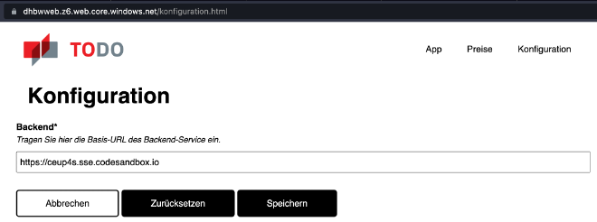
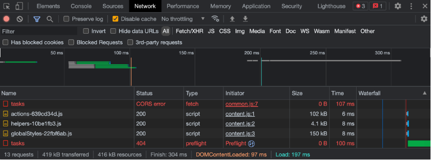
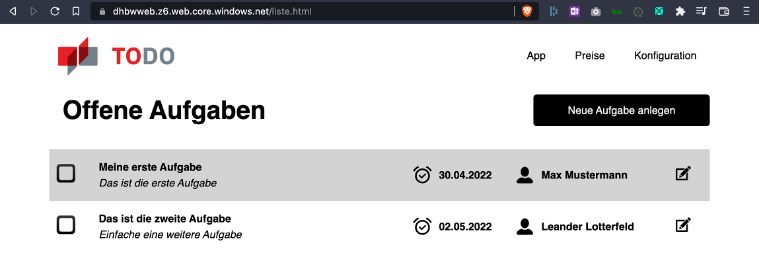

== Übungsaufgabe zu Modul 2c (CORS)

In dieser Übungsaufgabe wird ein Teil der Backend-API der aus der vorhergehenden Lehrveranstaltung bekannten Web-Anwendung mittels Javascript und den Bordmitteln von Node.js realisiert.

=== Platzhalter

Nachfolgend sind die spezifischen Parameter, die in der grundlegenden Einführung zu den Übungen erwähnt sind.

|===
|Platzhalter |Wert

|`<initial-github>`
|https://github.com/baitando/dhbw-distributed/tree/main/02c-cors/initial

|`<initial-download>`
|https://baitando.github.io/down-git/#/home?url=https://github.com/baitando/dhbw-distributed/tree/main/02c-cors/initial

|`<initial-ide>`
|https://stackblitz.com/fork/github/baitando/dhbw-distributed/tree/main/02c-cors/initial?file=src/server.js&initialpath=/swagger-ui&title=%C3%9Cbungsaufgabe%20%7C%20Modul%202c%20%28CORS%29
|===

=== Aufgabenbeschreibung

1. Versuchen Sie nun eine erste Integration mit dem Frontend der vorhergehenden Lehrveranstaltung.
a. Öffnen Sie https://dhbwweb.z6.web.core.windows.net/konfiguration.html.
b.	Ändern Sie die URL im Eingabefeld auf die URL Ihres Servers und speichern Sie.
+

+
c.	Öffnen Sie die Entwicklerkonsole und wechseln Sie in den Bereich, der Ihnen die Netzwerkaktivität zeigt.
d.	Öffnen Sie nun https://dhbwweb.z6.web.core.windows.net/liste.html.
e.	Die Liste sollte leer bleiben.
In der Entwicklerkonsole sollten Sie nun zwei Fehler erkennen können.
+

+
2. Bearbeiten Sie nun das TODO im bereitgestellten Code.
3. Testen Sie erneut mit dem Frontend, indem Sie https://dhbwweb.z6.web.core.windows.net/konfiguration.html aufrufen.
Sie sollten nun Einträge in der Liste sehen.
+

=== Lösungsbeispiel

Eine beispielhafte Lösung finden Sie auf GitHub unter https://github.com/baitando/dhbw-distributed/tree/main/02b-backend-js/uebung-1/result.

Sie können dieses Lösungsbeispiel durch Öffnen der URL https://stackblitz.com/github/baitando/dhbw-distributed/tree/main/02c-cors/result?file=src/server.js&initialpath=/swagger-ui&title=L%C3%B6sungsbeispiel%20%C3%9Cbungsaufgabe%20%7C%20Modul%202c%20%28CORS%29 im Browser direkt in der Online-Entwicklungsumgebung betrachten.
